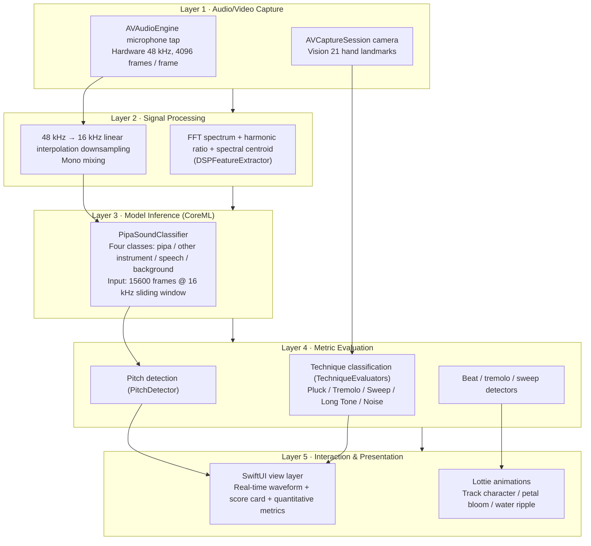

# PluckBuddy — AI Pipa Practice Companion

An intelligent pipa practice companion iOS app built on on-device CoreML. It uses the camera to recognize hand shape and the microphone to recognize sound, delivering real-time fingering scores, tuning assistance and metronome accompaniment, so that learners can develop a standard tone and rhythm at home.

> Competition entry · Mobile App Innovation Contest (Primary & Secondary School Division) · Launch Track
>
> Developer: Zehui Wu (吴泽荟)  
> School: Cogdel Cranleigh High School Wuhan (武汉康礼高级中学)

---

## Technical Contributions of This Project

The project makes technical innovations and engineering trade-offs in the following five directions.

### Contribution 1 · Audio-Video Multimodal Fusion for Fingering Detection

PluckBuddy fuses three signals — Vision hand landmarks, an FFT spectrum and a CoreML classifier — to decide among four fingering types: Pluck, Tremolo, Sweep and Long Tone.

- **Audio side**: the Accelerate framework performs a 4096-point FFT to estimate pitch and rhythm in real time; at the same time the 48 kHz hardware buffer is linearly interpolated and downsampled to 16 kHz and fed to the CoreML classifier as the gate that decides "is this a pipa"
- **Video side**: Vision tracks 21 hand landmarks; after Kalman-filter smoothing it computes the tiger mouth angle and wrist height as the geometric features for technique decisions
- **Fusion strategy**: audio decides "is this a pipa sound" (ruling out speech / ambient noise); video decides "is the hand shape correct"; only when both pass does the pipeline enter technique classification, avoiding single-modality misjudgment

### Contribution 2 · On-Device Self-Trained CoreML Pipa Sound Classifier

A self-trained four-class model is built in: `PipaSoundClassifier.mlmodel`. Its input is Float32 `audioSamples`, 15600 frames long, which is about a 0.975-second window at 16 kHz, and it outputs four class probabilities:

| Class             | Meaning              |
| ----------------- | -------------------- |
| `pipa`            | Pipa sound           |
| `other_instrument`| Other instrument     |
| `speech`          | Human speech         |
| `background`      | Background noise     |

- **On-device inference**: runs on the iPhone Neural Engine via `MLModel.prediction`; a single inference takes under 80 ms
- **Zero network dependency**: the whole inference is completed locally; no audio clip is ever uploaded
- **Precision optimization at the engineering layer**: the model itself is untouched. The threshold is 0.35 with a 2-frame moving average, plus energy gating that classifies low-RMS frames as background, and the inference step is 8000 frames instead of 15600 so consecutive windows overlap

### Contribution 3 · Real-Time Algorithms: 4096-Point FFT + Kalman Filtering

- **FFT spectrum analysis**: `DSPFeatureExtractor.swift` uses `vDSP_fft_zrip` (Accelerate-accelerated) to perform a 4096-point FFT and computes RMS, harmonic ratio, spectral centroid, zero-crossing rate and other indicators, which serve as the input features for pitch detection and the classifier
- **Kalman filter smoothing**: the 21 landmarks obtained by `HandPoseExtractor` jitter on every frame, and using them directly introduces noise; after Kalman-filter smoothing, the tiger mouth angle and wrist height are computed, giving a stable output of the tiger mouth opening in degrees
- **Parallel processing**: the microphone 4096-frame buffer and camera frames are captured on two independent threads without blocking each other; CoreML inference runs on the `inferenceQueue` serial queue and does not contend with the audio main thread

### Contribution 4 · Unified Audio Pipeline + Model Gating Architecture

On iOS, several modules all want the microphone, but the AVAudioEngine tap can only be installed by one processor — concurrent access from multiple modules conflicts directly. PluckBuddy's solution:

```
┌──────────────────────────────────────────────────┐
│ AudioManager (singleton)                         │
│ ├── AVAudioEngine                                │
│ ├── 4096-frame tap                               │
│ └── startListening { buffer in                   │
│     ├─→ Smart Tuner: PipaSoundGate (gate)        │
│     │   + PitchDetector                          │
│     ├─→ Pluck Run: RhythmDetector                │
│     ├─→ Tremolo Bloom: RollDetector              │
│     └─→ Sweep Wave: SweepDetector                │
│    }                                             │
└──────────────────────────────────────────────────┘
```

- A single AVAudioEngine and a single tap; all modules that need audio share one buffer callback
- `PipaSoundGate` loads `PipaSoundClassifier.mlmodel` independently and **does not take over the AVAudioEngine tap** — it only takes over "downsampling + model inference", avoiding resource contention with the Fingering Coach's Engine

### Contribution 5 · Fully Offline On-Device Five-Layer Architecture

See the next section, System Architecture, for the detailed diagram. Core innovations:

- The five layers, from bottom to top, are audio/video capture, signal processing, model inference, metric evaluation, and interaction and presentation. Each has a single responsibility and stays decoupled from the rest
- Capture, feature extraction, inference and evaluation each run on their own queue; the main thread only refreshes the UI
- Practice recordings, scores and leaderboards are all written to local CoreData. Nothing is uploaded and nothing is downloaded

---

## System Architecture

It adopts a fully offline on-device five-layer architecture: everything from raw microphone / camera data to UI feedback is completed on the iPhone, with no network dependency whatsoever.


How each layer maps to the code is shown below.



**Responsibilities of the Five Layers**

| Layer                       | Input                                | Output                                    | Key files                                                                                                                        |
| --------------------------- | ------------------------------------ | ----------------------------------------- | -------------------------------------------------------------------------------------------------------------------------------- |
| 1 · Audio/Video Capture     | The user playing in front of iPhone   | Raw PCM stream / camera frames             | `AudioManager.swift`, `CameraManager.swift`                                                                                       |
| 2 · Signal Processing       | Raw PCM                              | Spectral features / 16 kHz normalized samples | `DSPFeatureExtractor.swift`, `PipaSoundGate.swift` (downsampling)                                                             |
| 3 · Model Inference         | 15600 normalized frames              | 4-class probability distribution           | `PipaSoundClassifier.mlmodel`, `PipaSoundGate.swift` (inference)                                                                 |
| 4 · Metric Evaluation       | Spectral features + video landmarks  | Pitch / beat / technique decisions          | `PitchDetector.swift`, `RhythmDetector.swift`, `RollDetector.swift`, `SweepDetector.swift`, `TechniqueEvaluators.swift`          |
| 5 · Interaction & Presentation | Metric data                        | User-visible UI and animations              | 7 `*View.swift` files + `Animations/*.json`                                                                                       |

**Why It Is Layered This Way**

- Layer 1 focuses on capture: all I/O sits in one place, so multiple modules never fight over the AVAudioEngine tap
- Layer 2 normalizes formats: it converts the hardware 48 kHz into the 16 kHz 15600-frame window the model needs, so downstream components can be fed data without caring where it came from
- Layer 3 runs CoreML inference: under 80 ms per pass, fully offline
- Layer 4 holds the domain logic of playing: 5 detectors each cover one dimension and can be tested on their own
- Layer 5 only renders: SwiftUI subscribes to the ViewModel Published state and does no computation

---

## Core Features

| Module                    | Description                                                                                                                                                              |
| ------------------------- | ------------------------------------------------------------------------------------------------------------------------------------------------------------------------ |
| **Smart Fingering Coach** | Recognizes left/right hand shapes in real time with the camera (Vision framework), matches the 5 core pipa techniques (Pluck / Tremolo / Sweep / Long Tone / Noise), and produces frame-stable technique scores plus a rotating carousel of core requirements |
| **Smart Tuner**           | The microphone captures the open-string sound of the pipa; a self-developed FFT algorithm reports the current pitch and its cents deviation from the twelve-tone equal temperament standard. A CoreML classifier is wired in as gating: "decide pipa sound first → then decide pitch" |
| **Pluck Run**             | Gamified beat-track accompaniment. Each completed Pluck moves the character one cell forward on the track; it also tracks beat stability, BPM and the total score              |
| **Tremolo Bloom**         | Tremolo training visualized as a growing flower. It detects the evenness of consecutive fast plucks, and petals bloom after one round is completed                            |
| **Sweep Wave**            | Sweep training visualized as water ripples. It distinguishes up-sweep / down-sweep and generates a ripple animation in the corresponding direction                            |
| **Metronome**             | Independently adjustable BPM metronome, adapted to different practice scenarios                                                                                              |
| **Social Hub**            | Offline leaderboard / achievements / friend PK (local persistence, for demo purposes)                                                                                        |
| **Welcome Screen**        | Off-white background + Logo + "Let's practice 5 minutes today too" + 3-second countdown auto-dismiss + "Skip" in the top-right corner                                        |

---

## Tech Stack

- The app is written in Swift 6, with SwiftUI for the interface, Combine for state binding, and Swift Concurrency in strict mode
- It runs on arm64 devices with iOS 17.6 or later, and the camera and microphone features must be demonstrated on a real device
- On the algorithm side, vDSP from the Accelerate framework does the FFT, AVAudioEngine handles microphone capture, and Vision extracts hand landmarks
- The acoustic model is the self-trained CoreML classifier PipaSoundClassifier, which separates pipa, other instruments, speech and background noise, entirely offline
- Audio capture goes through the custom AudioManager, which installs one tap of 4096 frames per buffer and then linearly interpolates the hardware 48 kHz down to 16 kHz
- Hand shape comes from HandPoseExtractor, which returns 21 landmarks per hand, from which the tiger mouth angle and wrist height are computed
- Lottie drives the sweep water-ripple and track-character animations, and CoreData keeps practice records, leaderboards and achievements on the device

---

## Project Structure

```
PluckBuddy/
├── PluckBuddy.xcodeproj/        # Xcode project
├── PluckBuddy/                  # Main target source
│   ├── PluckBuddyApp.swift       # App entry (welcome/home switching)
│   ├── WelcomeView.swift         # Launch welcome page (3-second countdown fade-out)
│   ├── HomeView.swift            # Home page (entries to the seven modules)
│   ├── TechniqueCoachView*.swift # Smart Fingering Coach UI + ViewModel
│   ├── TunerView*.swift          # Smart Tuner UI + ViewModel
│   ├── RunningViewModel.swift    # Pluck Run ViewModel
│   ├── FlowerPracticeView.swift  # Tremolo Bloom UI
│   ├── FlowerViewModel.swift     # Tremolo Bloom ViewModel
│   ├── WavePracticeView.swift    # Sweep Wave UI
│   ├── WaveViewModel.swift       # Sweep Wave ViewModel
│   ├── MetronomeView.swift       # Metronome UI
│   ├── MetronomeManager.swift    # Metronome scheduling
│   ├── FriendPKView.swift        # Social Hub UI
│   ├── AchievementView.swift     # Achievements UI
│   ├── Persistence.swift         # CoreData persistence
│   ├── AudioManager.swift        # Unified audio capture
│   ├── PipaSoundClassifier.mlmodel  # On-device four-class CoreML model
│   ├── PipaSoundGate.swift       # Tuner-only pipa sound gate (loads the model independently to avoid fighting with the Fingering Coach over the AVAudioEngine tap)
│   ├── CameraManager.swift       # Camera capture (new rotation API)
│   ├── HandPoseExtractor.swift   # Vision hand shape extraction
│   ├── DSPFeatureExtractor.swift # Self-developed FFT spectral features
│   ├── PitchDetector.swift       # Pitch detection
│   ├── RhythmDetector.swift      # Pluck beat detection
│   ├── RollDetector.swift        # Tremolo detection
│   ├── SweepDetector.swift       # Sweep detection
│   ├── Animations/               # Lottie animation JSON
│   └── Assets.xcassets/          # Assets (Logo, etc.)
└── PluckBuddyTests/              # Unit test target
```

---

## How to Run

1. **Open** `PluckBuddy.xcodeproj` **with Xcode 17+ on a Mac**
2. Select the project on the left → TARGETS `PluckBuddy` → **Signing & Capabilities**
   - **Team**: choose your own Apple ID (a free account is enough)
   - **Bundle Identifier**: change it to one that is not registered under your account, e.g. `com.zehuiwu.pluckbuddy.intl`. The international edition intentionally uses the `.intl` suffix on the bundle id so that it differs from the Chinese edition (`com.zehuiwu.pluckbuddy`); this lets both the Chinese and English versions be installed on the same iPhone at the same time for side-by-side comparison
3. Connect a real device → pick iPhone in the device bar at the top → `Cmd+R`
4. **Real-device system requirement**: iOS 17.6 or later
5. **First time on a real device**: Settings → Privacy & Security → Developer Mode → turn it on and restart; when the app launches and reports "Untrusted Developer", go to Settings → General → VPN & Device Management → trust your Apple ID
6. **Camera / microphone modules** (Fingering Coach / Smart Tuner / the three companions) **must run on a real device**; the Simulator has no camera or microphone

The provisioning profile of a free Apple ID expires after 7 days; when it expires, reconnect to Xcode and re-sign to install again.

---

## Known Limitations / To Be Improved

- Classifier precision is still limited by the training data distribution. If the real-device console shows `rms > 0.05` but `pipa < 0.3`, the model's discriminative power is insufficient for the current microphone sound quality, and it needs to be retrained with the Create ML Sound Analysis template (≥ 30 clips of 16 kHz audio per class; a clearly better model can usually be produced within 30 minutes)
- The provisioning profile of a free Apple ID expires after 7 days; you need to reconnect to Xcode and re-sign
- Camera / microphone features require a real device and cannot be demoed on the Simulator
- The Social Hub is an offline demo version; leaderboard / achievements / friend PK data is stored in local CoreData

---

## License

Source code of a competition entry; for review and learning purposes only.
