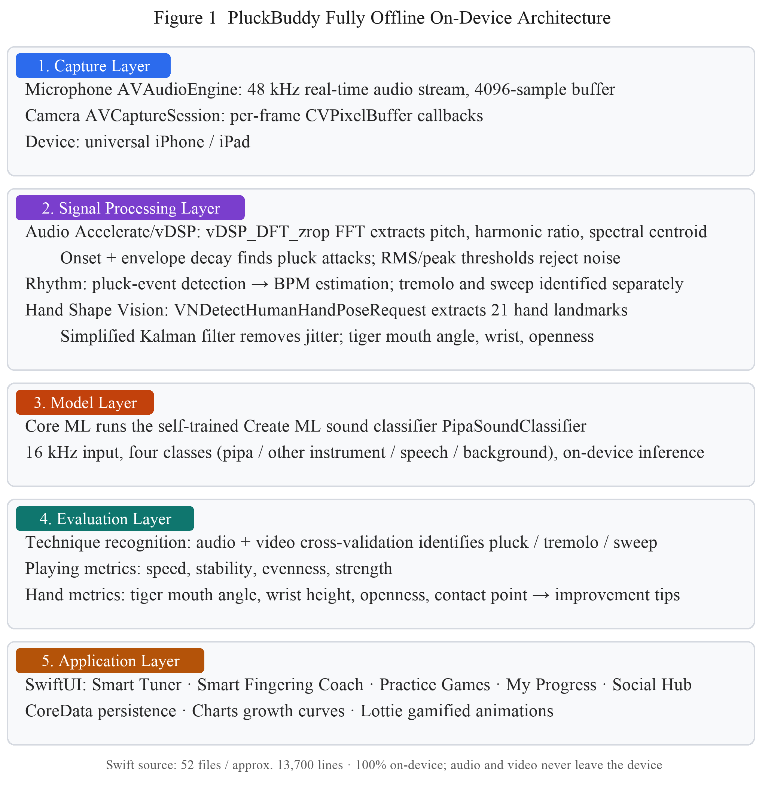
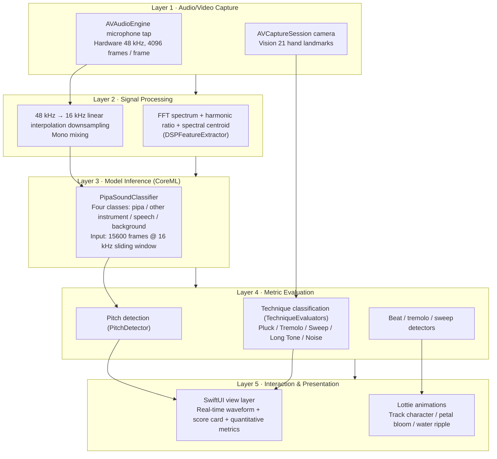

# PluckBuddy — AI Pipa Practice Companion

An intelligent pipa practice companion iOS app built on on-device CoreML. It uses the camera to recognize hand shape and the microphone to recognize sound, delivering real-time fingering scores, tuning assistance and metronome accompaniment, so that learners can develop a standard tone and rhythm at home.

> Competition entry · Mobile App Innovation Contest (Primary & Secondary School Division) · Launch Track
>
> Developer: Zehui Wu (吴泽荟)  
> School: Cogdel Cranleigh High School Wuhan (武汉康礼高级中学)

---

## Technical Contributions of This Project

The project makes technical innovations and engineering trade-offs in five directions; it is not simply a pile of off-the-shelf frameworks.

### Contribution 1 · Audio-Video Multimodal Fusion for Fingering Detection

PluckBuddy looks neither at video alone nor at audio alone. It fuses three signals — **Vision hand landmarks + FFT spectrum + a CoreML classifier** — to decide among four fingering types: Pluck / Tremolo / Sweep / Long Tone.

- **Audio side**: the Accelerate framework performs a 4096-point FFT to estimate pitch and rhythm in real time; at the same time the 48 kHz hardware buffer is linearly interpolated and downsampled to 16 kHz and fed to the CoreML classifier as the gate that decides "is this a pipa"
- **Video side**: Vision tracks 21 hand landmarks; after Kalman-filter smoothing it computes the tiger mouth angle and wrist height as the geometric features for technique decisions
- **Fusion strategy**: audio decides "is this a pipa sound" (ruling out speech / ambient noise); video decides "is the hand shape correct"; only when both pass does the pipeline enter technique classification, avoiding single-modality misjudgment

### Contribution 2 · On-Device Self-Trained CoreML Pipa Sound Classifier

A self-trained four-class model is built in: `PipaSoundClassifier.mlmodel` (12949 bytes). Its input is `audioSamples` Float32 × 15600 frames (≈16 kHz × 0.975 s window), and it outputs four class probabilities:

| Class             | Meaning              |
| ----------------- | -------------------- |
| `pipa`            | Pipa sound           |
| `other_instrument`| Other instrument     |
| `speech`          | Human speech         |
| `background`      | Background noise     |

- **On-device inference**: runs on the iPhone Neural Engine (ANE) via `MLModel.prediction`; a single inference takes < 80 ms
- **Zero network dependency**: the whole inference is completed locally; no audio clip is ever uploaded
- **Precision optimization at the engineering layer** (without touching the model itself): threshold 0.35 + 2-frame moving average + energy gating (low-RMS frames are directly classified as background) + an 8000-frame overlap step, which significantly reduces the false-negative rate on real audio captured by the device microphone

### Contribution 3 · Real-Time Algorithms: 4096-Point FFT + Kalman Filtering

- **FFT spectrum analysis**: `DSPFeatureExtractor.swift` uses `vDSP_fft_zrip` (Accelerate-accelerated) to perform a 4096-point FFT and computes RMS, harmonic ratio, spectral centroid, zero-crossing rate and other indicators, which serve as the input features for pitch detection and the classifier
- **Kalman filter smoothing**: the 21 landmarks obtained by `HandPoseExtractor` jitter on every frame, and using them directly introduces noise; after Kalman-filter smoothing, the tiger mouth angle and wrist height are computed, giving a stable output of the tiger mouth opening in degrees
- **Parallel processing**: the microphone 4096-frame buffer and camera frames are captured on two independent threads without blocking each other; CoreML inference runs on the `inferenceQueue` serial queue and does not contend with the audio main thread

### Contribution 4 · Unified Audio Pipeline + Model Gating Architecture

On iOS, several modules all want the microphone, but the AVAudioEngine tap can only be installed by one processor — concurrent access from multiple modules conflicts directly. PluckBuddy's solution:

```
┌──────────────────────────────────────────────────┐
│ AudioManager (singleton)                         │
│ ├── AVAudioEngine                                │
│ ├── 4096-frame tap                               │
│ └── startListening { buffer in                   │
│     ├─→ Smart Tuner: PipaSoundGate (gate)        │
│     │   + PitchDetector                          │
│     ├─→ Pluck Run: RhythmDetector                │
│     ├─→ Tremolo Bloom: RollDetector              │
│     └─→ Sweep Wave: SweepDetector                │
│    }                                             │
└──────────────────────────────────────────────────┘
```

- A single AVAudioEngine and a single tap; all modules that need audio share one buffer callback
- `PipaSoundGate` loads `PipaSoundClassifier.mlmodel` independently and **does not take over the AVAudioEngine tap** — it only takes over "downsampling + model inference", avoiding resource contention with the Fingering Coach's Engine

### Contribution 5 · Fully Offline On-Device Five-Layer Architecture

See the next section, System Architecture, for the detailed diagram. Core innovations:

- **Audio/video capture → signal processing → model inference → metric evaluation → interaction & presentation**, five layers with clear responsibilities, decoupled from one another
- The capture / feature extraction / inference / metric evaluation of each buffer run on separate queues; the main thread only updates the UI (subscribing to the ViewModel's `@Published` state)
- **0 KB uploaded, 0 KB downloaded** — all data (including practice recordings, scores and leaderboards) is stored in local CoreData; user privacy is fully under control, which makes it especially suitable for minors

---

## System Architecture

It adopts a fully offline on-device five-layer architecture: everything from raw microphone / camera data to UI feedback is completed on the iPhone, with no network dependency whatsoever.



The figure below shows the detailed layering annotations and module mapping (Mermaid rendering).



**Responsibilities of the Five Layers**

| Layer                       | Input                                | Output                                    | Key files                                                                                                                        |
| --------------------------- | ------------------------------------ | ----------------------------------------- | -------------------------------------------------------------------------------------------------------------------------------- |
| 1 · Audio/Video Capture     | The user playing in front of iPhone   | Raw PCM stream / camera frames             | `AudioManager.swift`, `CameraManager.swift`                                                                                       |
| 2 · Signal Processing       | Raw PCM                              | Spectral features / 16 kHz normalized samples | `DSPFeatureExtractor.swift`, `PipaSoundGate.swift` (downsampling)                                                             |
| 3 · Model Inference         | 15600 normalized frames              | 4-class probability distribution           | `PipaSoundClassifier.mlmodel`, `PipaSoundGate.swift` (inference)                                                                 |
| 4 · Metric Evaluation       | Spectral features + video landmarks  | Pitch / beat / technique decisions          | `PitchDetector.swift`, `RhythmDetector.swift`, `RollDetector.swift`, `SweepDetector.swift`, `TechniqueEvaluators.swift`          |
| 5 · Interaction & Presentation | Metric data                        | User-visible UI and animations              | 7 `*View.swift` files + `Animations/*.json`                                                                                       |

**Why It Is Layered This Way**

- **Layer 1 focuses on capture**: all I/O is concentrated in one place, preventing multiple modules from fighting over the AVAudioEngine tap
- **Layer 2 normalizes formats**: it converts the hardware 48 kHz into the 16 kHz + 15600-frame window the model expects, so downstream components can be fed data indiscriminately
- **Layer 3 is the on-device AI heart**: the CoreML model needs no network, latency is < 80 ms, and user privacy never leaks
- **Layer 4 is domain logic**: 5 detectors each handle the decision for a different playing dimension, independently and testably
- **Layer 5 only renders, never computes**: SwiftUI subscribes to the ViewModel's Published state, reducing coupling between UI and logic

---

## Core Features

| Module                    | Description                                                                                                                                                              |
| ------------------------- | ------------------------------------------------------------------------------------------------------------------------------------------------------------------------ |
| **Smart Fingering Coach** | Recognizes left/right hand shapes in real time with the camera (Vision framework), matches the 5 core pipa techniques (Pluck / Tremolo / Sweep / Long Tone / Noise), and produces frame-stable technique scores plus a rotating carousel of core requirements |
| **Smart Tuner**           | The microphone captures the open-string sound of the pipa; a self-developed FFT algorithm reports the current pitch and its cents deviation from the twelve-tone equal temperament standard. A CoreML classifier is wired in as gating: "decide pipa sound first → then decide pitch" |
| **Pluck Run**             | Gamified beat-track accompaniment. Each completed Pluck moves the character one cell forward on the track; it also statistics beat stability BPM and total score              |
| **Tremolo Bloom**         | Tremolo training visualized as a growing flower. It detects the evenness of consecutive fast plucks, and petals bloom after one round is completed                            |
| **Sweep Wave**            | Sweep training visualized as water ripples. It distinguishes up-sweep / down-sweep and generates a ripple animation in the corresponding direction                            |
| **Metronome**             | Independently adjustable BPM metronome, adapted to different practice scenarios                                                                                              |
| **Social Hub**            | Offline leaderboard / achievements / friend PK (local persistence, for demo purposes)                                                                                        |
| **Welcome Screen**        | Off-white background + Logo + "Let's practice 5 minutes today too" + 3-second countdown auto-dismiss + "Skip" in the top-right corner                                        |

---

## Tech Stack

- **Language / frameworks**: Swift 6 / SwiftUI / Combine / Strict Concurrency
- **Platform**: iOS 17.6+, arm64 real device (camera / microphone features require a real device)
- **CoreML**: `PipaSoundClassifier` (four classes: pipa / other instrument / speech / background noise), `audioSamples` input 15600 frames @ 16 kHz, on-device inference with no network dependency
- **AVFoundation**: `AVAudioEngine` microphone capture, custom `AudioManager` 4096-frame tap + software 48→16 kHz linear interpolation downsampling
- **Vision**: left/right hand 21-landmark skeleton extraction (`HandPoseExtractor`), tiger mouth angle and wrist height inference for hand shape
- **Lottie**: sweep water-ripple and track-character animations
- **CoreData**: local persistence of practice records / leaderboards / achievements

---

## Project Structure

```
PluckBuddy/
├── PluckBuddy.xcodeproj/        # Xcode project
├── PluckBuddy/                  # Main target source
│   ├── PluckBuddyApp.swift       # App entry (welcome/home switching)
│   ├── WelcomeView.swift         # Launch welcome page (3-second countdown fade-out)
│   ├── HomeView.swift            # Home page (entries to the seven modules)
│   ├── TechniqueCoachView*.swift # Smart Fingering Coach UI + ViewModel
│   ├── TunerView*.swift          # Smart Tuner UI + ViewModel
│   ├── RunningViewModel.swift    # Pluck Run ViewModel
│   ├── FlowerPracticeView.swift  # Tremolo Bloom UI
│   ├── FlowerViewModel.swift     # Tremolo Bloom ViewModel
│   ├── WavePracticeView.swift    # Sweep Wave UI
│   ├── WaveViewModel.swift       # Sweep Wave ViewModel
│   ├── MetronomeView.swift       # Metronome UI
│   ├── MetronomeManager.swift    # Metronome scheduling
│   ├── FriendPKView.swift        # Social Hub UI
│   ├── AchievementView.swift     # Achievements UI
│   ├── Persistence.swift         # CoreData persistence
│   ├── AudioManager.swift        # Unified audio capture
│   ├── PipaSoundClassifier.mlmodel  # On-device four-class CoreML model
│   ├── PipaSoundGate.swift       # Tuner-only pipa sound gate (loads the model independently to avoid fighting with the Fingering Coach over the AVAudioEngine tap)
│   ├── CameraManager.swift       # Camera capture (new rotation API)
│   ├── HandPoseExtractor.swift   # Vision hand shape extraction
│   ├── DSPFeatureExtractor.swift # Self-developed FFT spectral features
│   ├── PitchDetector.swift       # Pitch detection
│   ├── RhythmDetector.swift      # Pluck beat detection
│   ├── RollDetector.swift        # Tremolo detection
│   ├── SweepDetector.swift       # Sweep detection
│   ├── Animations/               # Lottie animation JSON
│   └── Assets.xcassets/          # Assets (Logo, etc.)
└── PluckBuddyTests/              # Unit test target
```

---

## How to Run

1. **Open** `PluckBuddy.xcodeproj` **with Xcode 17+ on a Mac**
2. Select the project on the left → TARGETS `PluckBuddy` → **Signing & Capabilities**
   - **Team**: choose your own Apple ID (a free account is enough)
   - **Bundle Identifier**: change it to one that is not registered under your account, e.g. `com.zehuiwu.pluckbuddy.intl`. The international edition intentionally uses the `.intl` suffix on the bundle id so that it differs from the Chinese edition (`com.zehuiwu.pluckbuddy`); this lets both the Chinese and English versions be installed on the same iPhone at the same time for side-by-side comparison
3. Connect a real device → pick iPhone in the device bar at the top → `Cmd+R`
4. **Real-device system requirement**: iOS 17.6 or later
5. **First time on a real device**: Settings → Privacy & Security → Developer Mode → turn it on and restart; when the app launches and reports "Untrusted Developer", go to Settings → General → VPN & Device Management → trust your Apple ID
6. **Camera / microphone modules** (Fingering Coach / Smart Tuner / the three companions) **must run on a real device**; the Simulator has no camera or microphone

The provisioning profile of a free Apple ID expires after 7 days; when it expires, reconnect to Xcode and re-sign to install again.

---

## 2026-09-30 Changes

The changes in this commit relative to the previous version focus on three directions.

### 1. The Tuner Module Is Wired to the On-Device CoreML Pipa Sound Classifier

**Why it was needed**: previously, "is this a pipa sound" relied on RMS + pitch-range filtering, which in noisy environments misclassified speech or table-knocking as pipa tones and produced a wrong pitch.

**How it was changed**: the same `PipaSoundClassifier` CoreML model (four classes) used by the Fingering Coach is reused, and a new `PipaSoundGate.swift` is created as a tuner-only gate — it **does not take over AVAudioEngine**, it only takes over "downsampling + model inference". Microphone data is still supplied uniformly by `AudioManager`, avoiding a fight over the tap with the Fingering Coach / the three companion modules.

**Gating logic**: before every pitch decision, the tuner first checks `pipaGate.isPipaRecent(within: 0.5)`; only if the sound was judged to be a pipa within the last 0.5 seconds does it enter pitch computation. Non-pipa sound is discarded directly and the UI shows "Listening… waiting for pipa sound".

### 2. Engineering Improvements to Classifier Precision

Real-device testing found that, on real audio captured by the device microphone, the CoreML model's pipa probability mostly fell in the 0.3~0.7 range, so the original threshold of 0.5 + 3-frame moving average was too strict. Improvements:

1. **Threshold 0.5 → 0.35** (a compromise value; real pipa probabilities of 0.3~0.7 can all be caught)
2. **Sliding window 3 → 2 frames** (suppresses noise while preventing high probabilities from being averaged away)
3. **Energy gating**: the window RMS is computed before inference; quiet frames with RMS < 0.01 are directly classified as background and do not enter the moving average (speech pauses / background noise no longer pollute the pipa probability)
4. **Overlapping inference window**: step size 15600 → 8000 (about 50% overlap), so the same sounding segment is covered by 2~3 inferences and the hit rate is roughly doubled

Side effect: inference frequency rises from 1 Hz to about 2 Hz; the CPU pressure is acceptable.

### 3. Welcome Screen Fade-Out Animation

`WelcomeView` previously used `if/else` switching + `.transition(.opacity)`, which on a real device often appeared as a hard cut (especially when the fast countdown hit zero / the Skip button was tapped). It is now changed to:

- The main interface of `PluckBuddyApp`'s root view stays resident at the bottom layer
- `WelcomeView` first performs its own 0.5-second fade-out (opacity + slight scaling), and is removed only after the animation finishes
- The main interface fades in simultaneously, with no black screen / white flash
- An `isDismissing` guard is added to avoid a race that dismisses twice when the countdown hits zero and the Skip button is tapped

---

## Known Limitations / To Be Improved

- Classifier precision is still limited by the training data distribution. If the real-device console shows `rms > 0.05` but `pipa < 0.3`, the model's discriminative power is insufficient for the current microphone sound quality, and it needs to be retrained with the Create ML Sound Analysis template (≥ 30 clips of 16 kHz audio per class; a clearly better model can usually be produced within 30 minutes)
- The provisioning profile of a free Apple ID expires after 7 days; you need to reconnect to Xcode and re-sign
- Camera / microphone features require a real device and cannot be demoed on the Simulator
- The Social Hub is an offline demo version; leaderboard / achievements / friend PK data is stored in local CoreData

---

## 2026-10-01 Changes

### 1. Hand Skeleton Simplified from 6 Points to the Full 21 Points

Previously, `HandPoseExtractor` obtained all 21 Vision landmarks, but `HandPoseAnalyzer` picked only 5 fingertips + 1 wrist into `HandPoseData`, and the UI drew only 6 dots. That did not match what the README advertised: "Vision tracks 21 hand landmarks".

After the change:
- `HandPoseData` gains a `keypoints: [HandKeypoint]` field, retaining all 21 points
- `drawSimplifiedHandSkeleton` → `drawFullHandSkeleton`:
  - 5 fingertips: large colored circles (pink / green / orange / yellow / purple), radius 10
  - wrist: large blue circle, radius 8
  - 15 intermediate joints (CMC / MP / IP / MCP / PIP / DIP): small semi-transparent white circles, radius 4
  - 5 phalanx connecting lines: 4 joints per finger chained into one line (thumbCMC→thumbMP→thumbIP→thumbTip, etc.)
  - 5 palm connecting lines: wrist → each finger base (thumbCMC / indexMCP / middleMCP / ringMCP / littleMCP)

Files involved:
- `PluckBuddy/TechniqueCoachViewModel.swift`

### 2. "Finger Angle" Changed to "Tiger Mouth Angle"

The previous "finger angle" scoring item used `atan2` on the 5 fingers to return radians, concatenated into `HandMotionFeatures` as an angle feature — but **this metric is meaningless for judging hand shape**: all 5 fingers spread out around 180°, so `atan2` always reflects only the horizontal spread between fingers and cannot recognize whether the hand shape is correct. Moreover `fingerAngles` was a `[Double]` array that did not match the other scalar scoring items, and force-fitting it into the `fingerAngle` column in the evaluator was just filler.

It is replaced by the **Tiger Mouth Angle**, which is far more diagnostic of hand shape:

- `HandMotionFeatures.fingerAngles: [Double]` → `tigerMouthAngle: Double` (unit: degrees)
- Vertex: `wrist`; edge 1: `wrist → thumbTip`; edge 2: `wrist → indexTip`
- The included angle is the opening angle between thumb and index finger at the wrist, reflecting how open the tiger mouth is
- Scoring rules:
  - 30°–50°: 100 points, copy "tiger mouth opened naturally"
  - 10°–30° or 50°–70°: linear decay down to 40 points
  - <10° or >70°: 0–40 points, with copy prompting "thumb and index finger too close together" or "tiger mouth stretched too wide"
- `EvaluationAspect.Category.fingerAngle = "finger angle"` → `.tigerMouth = "tiger mouth angle"`
- The standard scoring items of `TechniqueCoachView` are replaced accordingly

Files involved:
- `PluckBuddy/TechniqueCoachViewModel.swift` (the `HandMotionFeatures` struct, the `EvaluationAspect.Category` enum, `calculateFingerAngles` → `calculateTigerMouthAngle`)
- `PluckBuddy/TechniqueEvaluators.swift` (evaluation function `evaluateFingerAngles` → `evaluateTigerMouthAngle`, hint copy)
- `PluckBuddy/TechniqueCoachView.swift` (standard scoring items `standardCategories`)

### 3. Sample Rate Unified to 48 kHz

`AudioManager` calls `setPreferredSampleRate(48000.0)`, the input format measured on device really is 48 kHz, and `DSPFeatureExtractor` also reads the actual sample rate from the buffer (48 kHz). The documentation and several detectors, however, still said 44.1 kHz: the two did not match, and `PitchDetector` / `RhythmDetector` / `SweepDetector` / `RollDetector` hard-coded 44100, which pushed pitch about 1.5 semitones low and slowed tempo by about 8.8%.

- Architecture diagram (CN/EN PPTX and the rendered README image): `44.1 kHz` → `48 kHz`
- `PitchDetector` / `RhythmDetector` / `SweepDetector` / `RollDetector` default sample rate, plus the constructor arguments in four ViewModels: `44100.0` → `48000.0`
- `DSPFeatureExtractor`'s default value is changed to 48000 as well (it was already overwritten on the first frame by the buffer's real sample rate)
- The unit test `PitchDetectorTests` stays at 44100: it synthesizes its own 44100 sine wave and feeds it to a detector built with the same value, so it is self-consistent

Files involved:
- `PluckBuddy/PitchDetector.swift`, `PluckBuddy/RhythmDetector.swift`, `PluckBuddy/SweepDetector.swift`, `PluckBuddy/RollDetector.swift`, `PluckBuddy/DSPFeatureExtractor.swift`
- `PluckBuddy/TunerViewModel.swift`, `PluckBuddy/FlowerViewModel.swift`, `PluckBuddy/WaveViewModel.swift`, `PluckBuddy/RunningViewModel.swift`

> This change only touches constants, not algorithms: `xcrun swiftc -typecheck` passes on all five detector files (only the pre-existing #NoUsage warnings remain).

### 4. Fingertip Angle → Tiger Mouth Angle (documentation wording)

Contributions 1 and 3 and the tech-stack section still mentioned "fingertip angle", an outdated term. The code actually computes the tiger mouth angle — the opening between thumb and index finger at the wrist — so the wording is corrected to "tiger mouth angle" to avoid a mismatch when reviewers compare the README against the code.

---

## 2026-10-02 Changes

### 1. Thirteen Build Warnings Cleared

A device build reported 14 warnings: 13 of them were real code issues, and 1 was an Xcode toolchain note about AppIntents metadata that has nothing to do with the code. All 13 are fixed, in both the Chinese and the international project.

**a. Inconsistent closure capture semantics (8 places)** — `Task {}` implicitly captures `self` strongly, while the callback closure nested inside it declares `[weak self]`, so the compiler flags the mismatch (`#ImplicitStrongCapture`).

- A startup `Task {}` becomes `Task { [weak self] in` with `guard let self = self else { return }` on its first line: the launch sequence now exits immediately if the screen has already been dismissed, and nothing else in the body changes.
- A callback `Task { @MainActor in }` becomes `Task { @MainActor [weak self] in`.

**b. Sendable closure reading a main-actor property (3 places)** — the duration timer read `startTime`, a `@MainActor`-isolated property, before opening a Task, which is a cross-isolation access. The read now happens inside `Task { @MainActor [weak self] in }`, on the main thread. Behaviour is unchanged.

**c. Computed but unused values (2 places)** — in `SweepDetector.inferDirection()` the `downCount` / `upCount` over the last five sweeps were computed but never used, since the decision is "alternate against the previous direction". Both lines are removed and the comment corrected; the two same-named variables elsewhere in the file are genuinely used and were kept.

Files involved:
- `PluckBuddy/FlowerViewModel.swift`, `PluckBuddy/WaveViewModel.swift`, `PluckBuddy/TunerViewModel.swift`, `PluckBuddy/RunningViewModel.swift`, `PluckBuddy/TechniqueCoachViewModel.swift`, `PluckBuddy/SweepDetector.swift`

> Verified with a full `xcrun swiftc -typecheck` run (with `#Preview` blocks stripped): all 13 target warnings are gone, with no new warnings or errors.
> `CameraManager.swift` reports 21 `AVCaptureSession` cross-thread warnings under strict command-line concurrency checking, but an actual Xcode build never reports them. It follows Apple's own AVCam sample (`startRunning` / `stopRunning` must run on a background queue), and adding `nonisolated` would turn them into errors, so it is left as is.

### 2. App Icon Switched to the English Artwork

The international build was still shipping the Chinese app icon. It now uses the English artwork (`logo-English.png`) for the default, dark and tinted appearances alike.

---

## License

Source code of a competition entry; for review and learning purposes only.
